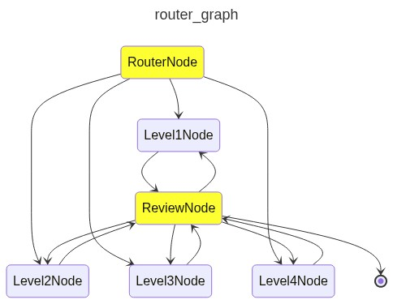

# Dream Factory Evaluations

## Table of Contents

- [Setup](#setup)
  - [Install uv](#install-uv)
  - [Environment Variables](#environment-variables)
- [Overview](#overview)
- [Database Schema](#database-schema)
  - [Tables](#tables)
  - [Roles & Access Control](#roles--access-control)
- [Implementation](#implementation)
  - [1. MCP Server](#1-mcp-server)
  - [2. Evaluation System](#2-evaluation-system)
  - [3. Value Proposition](#3-value-proposition)
- [Running Evaluations](#running-evaluations)
- [Creating Leaderboards](#creating-leaderboards)
- [Example Queries](#example-queries)
- [Bonus: Multi-Level Agent Graph](#bonus-multi-level-agent-graph)

## Setup

### Install uv

https://docs.astral.sh/uv/getting-started/installation/

### Environment Variables

Create a `.env` file in the project root with the following environment variables:

```bash
# DreamFactory API Configuration (Required)
DREAM_FACTORY_BASE_URL=https://demov7.dreamfactory.com/api/v2/yearlingsolutions
DREAM_FACTORY_CEO_API_KEY=your-ceo-api-key
DREAM_FACTORY_HR_API_KEY=your-hr-api-key
DREAM_FACTORY_FINANCE_API_KEY=your-finance-api-key
DREAM_FACTORY_OPS_API_KEY=your-ops-api-key

# DreamFactory API Configuration for the new data
NEW_DREAM_FACTORY_BASE_URL="https://demov7.dreamfactory.com/api/v2/yearling2"
NEW_DREAM_FACTORY_CEO_API_KEY=your-new-ceo-api-key
NEW_DREAM_FACTORY_HR_API_KEY=your-new-hr-api-key
NEW_DREAM_FACTORY_FINANCE_API_KEY=your-new-finance-api-key
NEW_DREAM_FACTORY_OPS_API_KEY=your-new-ops-api-key

# Logfire configuration for leaderboard creation (Required for leaderboards)
LOGFIRE_READ_TOKEN=your-logfire-read-token

# Optional: Evaluation defaults (can be overridden via CLI)
PROMPT_NAME=basic_prompt.txt
MAX_TOOL_CALLS=20
RETRIES=3
SCORES_DIR=scores
```

#### Required Environment Variables

| Variable | Description | Example |
|----------|-------------|---------|
| `DREAM_FACTORY_BASE_URL` | Base URL for your DreamFactory API | `https://demov7.dreamfactory.com/api/v2/yearlingsolutions` |
| `DREAM_FACTORY_CEO_API_KEY` | API key for CEO role (full access) | `your-ceo-api-key` |
| `DREAM_FACTORY_HR_API_KEY` | API key for HR role (hr_* tables only) | `your-hr-api-key` |
| `DREAM_FACTORY_FINANCE_API_KEY` | API key for Finance role (finance_* tables only) | `your-finance-api-key` |
| `DREAM_FACTORY_OPS_API_KEY` | API key for Operations role (ops_* tables only) | `your-ops-api-key` |
| `NEW_DREAM_FACTORY_*` | New Data DreamFactory API configuration | N/A |
| `LOGFIRE_READ_TOKEN` | Logfire read token for leaderboard creation | N/A |

#### Optional Environment Variables

| Variable | Description | Default |
|----------|-------------|---------|
| `PROMPT_NAME` | Default prompt file to use | `basic_prompt.txt` |
| `MAX_TOOL_CALLS` | Maximum tool calls per evaluation | `20` |
| `RETRIES` | Number of retries for failed requests | `3` |
| `SCORES_DIR` | Directory for leaderboard scores | `scores` |

### Logging and Observability

Every agent run is automatically logged to **Logfire**, which is based on **OpenTelemetry**. This provides comprehensive observability for:

- **Agent execution traces** - Complete execution flow and timing
- **Tool calls** - All MCP tool invocations and responses  
- **Model interactions** - LLM requests and responses
- **Performance metrics** - Duration, token usage, and costs
- **Error tracking** - Detailed error logs and stack traces

The `LOGFIRE_READ_TOKEN` is required for the leaderboard creation system to query these logged evaluation results and generate performance comparisons.

## Overview

We are evaluating how an `Agent` uses the `DreamFactory` `MCP` server.

**What we evaluate for each query:**

1. **Actual output** - The structured response from the agent
2. **Tool calls** - Number and parameters of MCP tool calls made
3. **Duration** - Time taken to complete the query
4. **Cost** - Resource consumption metrics

This evaluation framework helps assess agent performance across different complexity levels and roles.

## Database Schema

### Tables

We have **8 tables** in our database organized by business function:

| **HR Tables** | **Finance Tables** | **Operations Tables** |
|---------------|--------------------|-----------------------|
| `hr_employees` | `finance_expenses` | `ops_machines` |
| `hr_departments` | `finance_products` | `ops_maintenance` |
| `hr_policies` | `finance_revenues` | |

### Roles & Access Control

We have **4 roles** with different access permissions:

| Role | Access Level | Available Tables |
|------|-------------|------------------|
| `CEO` | **All tables** | All 8 tables |
| `HR` | **HR only** | `hr_employees`, `hr_departments`, `hr_policies` |
| `Finance` | **Finance only** | `finance_expenses`, `finance_products`, `finance_revenues` |
| `Ops` | **Operations only** | `ops_machines`, `ops_maintenance` |

Each role has its own API key for authentication and authorization.

## Implementation

### 1. MCP Server

The MCP server (`src/dream_factory_evals/df_mcp.py`) provides a standardized interface to DreamFactory APIs.

**Configuration:** The server uses `DREAM_FACTORY_BASE_URL` and `DREAM_FACTORY_API_KEY` environment variables.

#### Available Tools

| Tool | Purpose | Parameters |
|------|---------|------------|
| `get_table_schema` | Retrieves table structure and field types | `table_name` |
| `get_table_records` | Fetches records with filtering, pagination, joining | `table_name`, `filter`, `fields`, `limit`, `offset`, `order_field`, `related` |
| `get_table_records_by_ids` | Retrieves specific records by ID | `table_name`, `ids`, `fields`, `related` |
| `calculate_sum` | Computes sum of numerical values | `values` |
| `calculate_difference` | Calculates difference between numbers | `num1`, `num2` |
| `calculate_mean` | Computes arithmetic mean | `values` |

#### RBAC Implementation

Role-Based Access Control (RBAC) is enforced at the API level:

- **Server-side enforcement:** If an agent tries to access unauthorized tables, the server returns an error
- **Client-side filtering:** We filter available tables based on role before agent execution

**Workaround for table discovery:**

> **Note:** Non-CEO roles are not authorized to call the `list_table_names` tool, which is why it's implemented as a plain function rather than an MCP tool and must be called manually with CEO privileges.

1. Use `CEO` API key to call `list_table_names`
2. Filter tables by role prefix (e.g., `hr_` for HR role)
3. Include filtered table list in agent's system prompt

### 2. Evaluation System

We have **4 complexity levels** with **3-5 queries per role** at each level.

#### Evaluation Structure

Each evaluation case contains:

```python
{
    "query_id": "hr_l1_1",
    "query": "How many employees are there?",
    "expected_response": {...},
    "expected_tool_calls": [...]
}
```

#### The Pydantic Solution

**Problem:** LLM responses vary even for identical queries:
- `100` vs `100.0` vs `"One Hundred"` vs `"There are 100 employees"`

**Solution:** Use Pydantic models to enforce structured outputs:

```python
from pydantic import BaseModel
from pydantic_evals import Case

class EmployeeCount(BaseModel):
    number_of_employees: int

case = Case(
    name="hr_l1_1",
    inputs=Query(
        query="How many employees are there?",
        output_type=EmployeeCount
    ),
    expected_output=QueryResult(
        result=EmployeeCount(number_of_employees=100)
    )
)
```

#### Handling Free-Form Text

For strategic recommendations and analysis, we use semantic comparison:

```python
class Analysis(BaseModel):
    better_performing_category: Literal["Software", "Electronics"]
    revenue_to_marketing_efficiency: str

    def __eq__(self, other: object) -> bool:
        if not isinstance(other, Analysis):
            return NotImplemented
        return (
            self.better_performing_category == other.better_performing_category
            and are_strings_similar(
                self.revenue_to_marketing_efficiency, 
                other.revenue_to_marketing_efficiency
            )
        )
```

The `are_strings_similar()` function uses a small LLM to compare semantic meaning rather than exact text matching.

#### Complex Evaluation Example

Here's a Level 4 finance query with multi-part analysis:

```python
class RevenueComparison(BaseModel):
    quarterly_comparison: dict[Literal["Software", "Electronics"], CategoryPerformance]
    marketing_expenses: MarketingExpenses
    analysis: Analysis
    strategic_recommendation: str

    def __eq__(self, other: object) -> bool:
        if not isinstance(other, RevenueComparison):
            return NotImplemented
        return (
            self.quarterly_comparison == other.quarterly_comparison
            and self.marketing_expenses == other.marketing_expenses
            and self.analysis == other.analysis
            and are_strings_similar(self.strategic_recommendation, other.strategic_recommendation)
        )

case = Case(
    name="finance_l4_1",
    inputs=Query(
        query=(
            "Compare Q4 2023 vs Q4 2024 revenue performance for 'Software' and 'Electronics' products. "
            "Calculate growth rates and identify which category performed better. "
            "Also analyze total 'Marketing' expenses for both quarters. "
            "Provide one strategic recommendation based on the revenue-to-marketing spend efficiency."
        ),
        output_type=RevenueComparison
    ),
    expected_output=QueryResult(
        result=RevenueComparison(
            quarterly_comparison={
                "Software": CategoryPerformance(
                    Q4_2023_revenue=15420.33,
                    Q4_2024_revenue=28750.12,
                    growth_rate_percentage=86.4
                ),
                "Electronics": CategoryPerformance(
                    Q4_2023_revenue=13831.28,
                    Q4_2024_revenue=34569.61,
                    growth_rate_percentage=149.9
                )
            },
            marketing_expenses=MarketingExpenses(
                Q4_2023=2450.75,
                Q4_2024=3200.50
            ),
            analysis=Analysis(
                better_performing_category="Electronics",
                revenue_to_marketing_efficiency="Electronics showed 149.9% growth vs 86.4% for Software, while marketing spend increased only 30.6%"
            ),
            strategic_recommendation="Allocate more marketing budget to Electronics products in Q1 2025, as they demonstrate superior growth response to marketing investment."
        )
    )
)
```

#### Tool Call Evaluation

We also evaluate the **MCP tool calls** made by the agent:

```python
expected_tool_calls = [
    ToolCall(
        tool_name="get_table_records",
        params={
            "table_name": "finance_revenues",
            "filter": "((quarter='Q4') AND (year=2023)) OR ((quarter='Q4') AND (year=2024))",
            "fields": ["product_category", "revenue", "quarter", "year"]
        }
    ),
    ToolCall(
        tool_name="get_table_records", 
        params={
            "table_name": "finance_expenses",
            "filter": "((quarter='Q4') AND (year=2023) AND (category='Marketing')) OR ((quarter='Q4') AND (year=2024) AND (category='Marketing'))"
        }
    )
]
```

#### Dataset Organization

Each role/level combination has its own dataset:

```
evals/
├── level1/
│   ├── finance/evals.py
│   ├── hr/evals.py
│   └── ops/evals.py
├── level2/
│   ├── finance/evals.py
│   ├── hr/evals.py
│   └── ops/evals.py
└── ...
```

Each directory contains:
- `evals.py` - Dataset with test cases
- `output_types.py` - Pydantic models for structured outputs

### 3. Value Proposition

This evaluation framework provides several key insights:

1. **Structured Output Validation** - Using Pydantic models ensures consistent, comparable results across different LLM runs

2. **Semantic Text Comparison** - For free-form text, we use LLM-based semantic comparison rather than exact string matching

3. **Tool Usage Analysis** - Detailed tracking of MCP tool calls helps optimize agent efficiency

4. **Role-Based Evaluation** - Testing different access levels ensures proper RBAC implementation

5. **Complexity Scaling** - Four difficulty levels help identify where agents start to struggle

## Running Evaluations

### CLI Interface

The evaluation system provides a CLI tool for running evaluations:

```bash
# Basic usage
uv run src/dream_factory_evals/run_eval.py run <model> <role> <level>

# Examples
uv run src/dream_factory_evals/run_eval.py run "openai:gpt-4.1-mini" hr 2
uv run src/dream_factory_evals/run_eval.py run "anthropic:claude-4-sonnet-20250514" finance 3
uv run src/dream_factory_evals/run_eval.py run "google-gla:gemini-2.0-flash" ops 1
```

### CLI Options

```bash
# Custom report name
uv run src/dream_factory_evals/run_eval.py run "openai:gpt-4.1-mini" hr 2 --report-name "my-custom-test"

# Custom prompt file
uv run src/dream_factory_evals/run_eval.py run "openai:gpt-4.1-mini" hr 2 --prompt-name "advanced_prompt.txt"

# Adjust retry and tool call limits
uv run src/dream_factory_evals/run_eval.py run "openai:gpt-4.1-mini" hr 2 --max-tool-calls 30 --retries 5

# Enable thinking tool for step-by-step reasoning
uv run src/dream_factory_evals/run_eval.py run "openai:gpt-4.1-mini" hr 2 --think
```

### Environment Variables

Configure defaults using environment variables:

```bash
export PROMPT_NAME="basic_prompt.txt"
export MAX_TOOL_CALLS="20"
export RETRIES="3"
```

### List Available Options

```bash
# List all available models
uv run src/dream_factory_evals/run_eval.py list-models

# List all available roles  
uv run src/dream_factory_evals/run_eval.py list-roles
```

### Comparing Models

```bash
# Test multiple models on the same dataset
for model in "openai:gpt-4.1-mini" "anthropic:claude-4-sonnet-20250514" "google-gla:gemini-2.0-flash"; do
    uv run src/dream_factory_evals/run_eval.py run "$model" hr 2
done
```

### Comparing Configurations

You can also compare the same model with different configurations to optimize performance:

```bash
# Compare different prompts
uv run src/dream_factory_evals/run_eval.py run "openai:gpt-4.1-mini" hr 2 --prompt-name "basic_prompt.txt" --report-name "gpt-4.1-mini-hr-2-basic"
uv run src/dream_factory_evals/run_eval.py run "openai:gpt-4.1-mini" hr 2 --prompt-name "advanced_prompt.txt" --report-name "gpt-4.1-mini-hr-2-advanced"

# Compare with and without think tool
uv run src/dream_factory_evals/run_eval.py run "openai:gpt-4.1-mini" hr 2 --report-name "gpt-4.1-mini-hr-2-no-think"
uv run src/dream_factory_evals/run_eval.py run "openai:gpt-4.1-mini" hr 2 --think --report-name "gpt-4.1-mini-hr-2-with-think"

# Compare all configurations for a model
model="openai:gpt-4.1-mini"
role="hr"
level=2

# Basic prompt without think
uv run src/dream_factory_evals/run_eval.py run "$model" "$role" "$level" --prompt-name "basic_prompt.txt" --report-name "${model}-${role}-${level}-basic"

# Basic prompt with think
uv run src/dream_factory_evals/run_eval.py run "$model" "$role" "$level" --prompt-name "basic_prompt.txt" --think --report-name "${model}-${role}-${level}-basic-think"

# Advanced prompt without think
uv run src/dream_factory_evals/run_eval.py run "$model" "$role" "$level" --prompt-name "advanced_prompt.txt" --report-name "${model}-${role}-${level}-advanced"

# Advanced prompt with think
uv run src/dream_factory_evals/run_eval.py run "$model" "$role" "$level" --prompt-name "advanced_prompt.txt" --think --report-name "${model}-${role}-${level}-advanced-think"
```

## Creating Leaderboards

After running evaluations, you can create leaderboards to compare model performance across multiple evaluation reports.

### CLI Interface

```bash
# Basic leaderboard creation
uv run src/dream_factory_evals/create_leaderboard.py <leaderboard_name> <report_name1> <report_name2> [...]

# Example: Compare HR Level 1 performance across models
uv run src/dream_factory_evals/create_leaderboard.py "hr-level-1-comparison" \
  "openai:gpt-4o-hr-level-1" \
  "openai:gpt-4o-mini-hr-level-1" \
  "anthropic:claude-3-sonnet-hr-level-1"
```

### Leaderboard Outputs

The CLI generates two files in the `scores/` directory:

1. **Summary Leaderboard** (`<leaderboard_name>.csv`):
   - Aggregated metrics per model
   - Average score, accuracy, tool calls, and duration
   - Total scores and query counts
   - Ranked by average score (descending)

2. **Detailed Results** (`detailed_<leaderboard_name>.csv`):
   - All individual query results
   - Useful for deep-dive analysis

### Example Workflow

```bash
# 1. Run evaluations for multiple models
uv run src/dream_factory_evals/run_eval.py run "openai:gpt-4.1-nano" hr 1
uv run src/dream_factory_evals/run_eval.py run "openai:gpt-4.1-mini" hr 1

# 2. Create leaderboard
uv run src/dream_factory_evals/create_leaderboard.py "hr-level-1-leaderboard" \
  "openai:gpt-4.1-nano-hr-level-1" "openai:gpt-4.1-mini-hr-level-1"
```

**Summary Leaderboard (`hr-level-1-leaderboard.csv`):**

| evaluation_name | avg_score | avg_accuracy | avg_tool_calls | avg_duration | total_score | query_count |
|----------------|-----------|--------------|----------------|--------------|-------------|-------------|
| openai:gpt-4.1-mini-hr-level-1 | 2.6 | 2.0 | 0.6 | 14.86 | 13 | 5 |
| openai:gpt-4.1-nano-hr-level-1 | 2.4 | 2.0 | 0.4 | 12.52 | 12 | 5 |

**Detailed Results (`detailed_hr-level-1-leaderboard.csv`):**

| evaluation_name | case_name | duration | accuracy | score | correct_tool_calls | notes |
|----------------|-----------|----------|----------|-------|-------------------|-------|
| openai:gpt-4.1-nano-hr-level-1 | hr_l1_q1 | 15.15 | 2 | 2 | 0 | Too many tool calls: 2 > 1 |
| openai:gpt-4.1-nano-hr-level-1 | hr_l1_q2 | 11.11 | 2 | 3 | 1 | ✓ |
| openai:gpt-4.1-nano-hr-level-1 | hr_l1_q3 | 13.53 | 2 | 2 | 0 | Too many tool calls: 2 > 1 |
| openai:gpt-4.1-nano-hr-level-1 | hr_l1_q4 | 14.34 | 2 | 3 | 1 | ✓ |
| openai:gpt-4.1-nano-hr-level-1 | hr_l1_q5 | 8.47 | 2 | 2 | 0 | Too many tool calls: 2 > 1 |
| openai:gpt-4.1-mini-hr-level-1 | hr_l1_q1 | 11.44 | 2 | 3 | 1 | ✓ |
| openai:gpt-4.1-mini-hr-level-1 | hr_l1_q2 | 9.78 | 2 | 2 | 0 | Tool call params mismatch |
| openai:gpt-4.1-mini-hr-level-1 | hr_l1_q3 | 24.78 | 2 | 2 | 0 | Too many tool calls: 3 > 1 |
| openai:gpt-4.1-mini-hr-level-1 | hr_l1_q4 | 18.77 | 2 | 3 | 1 | ✓ |
| openai:gpt-4.1-mini-hr-level-1 | hr_l1_q5 | 9.53 | 2 | 3 | 1 | ✓ |

**Key Insights:**
- Both models achieved perfect accuracy (2.0) on all queries
- `gpt-4.1-mini` scored slightly higher overall (2.6 vs 2.4 average score)
- `gpt-4.1-nano` was faster on average (12.52s vs 14.86s)
- Main difference: tool call efficiency - both models sometimes made unnecessary extra tool calls

### Leaderboard Metrics

| Metric | Description |
|--------|-------------|
| `avg_score` | Average score across all queries (accuracy × 2 + correct_tool_calls) |
| `avg_accuracy` | Average accuracy percentage |
| `avg_tool_calls` | Average number of correct tool calls |
| `avg_duration` | Average query completion time |
| `total_score` | Sum of all scores |
| `query_count` | Total number of queries evaluated |

## Example Queries

### Level 1 Query (Basic)
```python
Query: "How many employees are there?"
Expected Output: EmployeeCount(number_of_employees=100)
Expected Tool Calls: [get_table_records(table_name="hr_employees")]
```

### Level 2 Query (Joining)
```python
Query: "What department does Alice Johnson work in?"
Expected Output: EmployeeDepartment(employee="Alice Johnson", department="Sales")
Expected Tool Calls: [
    get_table_records(
        table_name="hr_employees",
        filter="(first_name='Alice') AND (last_name='Johnson')",
        related="hr_departments_by_department_id"
    )
]
```

### Level 4 Query (Complex Analysis)
```python
Query: "Compare Q4 2023 vs Q4 2024 revenue performance..."
Expected Output: RevenueComparison(
    quarterly_comparison={...},
    marketing_expenses={...},
    analysis={...},
    strategic_recommendation="..."
)
Expected Tool Calls: [
    get_table_records(...),  # Revenue data
    get_table_records(...),  # Marketing expenses
    calculate_difference(...),  # Growth calculations
]
```

## Bonus: Multi-Level Agent Graph

### Overview

Beyond the standard evaluation framework, we've implemented an advanced **multi-level agent graph** that automatically routes queries to specialized agents based on complexity. This system uses different agents optimized for each difficulty level, with a router to determine the appropriate level and a review system for quality control.



### Architecture

The graph consists of several key components:

1. **Router Agent** - Analyzes incoming queries and determines the appropriate complexity level
2. **Level-Specific Agents** - Specialized agents optimized for each difficulty level
3. **Review Agent** - Validates responses and can trigger re-routing if needed
4. **Feedback Loop** - Failed reviews can route back to appropriate level agents

### Agent Specialization

Each level agent is optimized differently to handle increasing complexity:

| Level | Agent Characteristics | Optimization Focus |
|-------|----------------------|-------------------|
| **Level 1** | Basic model, simple prompts | Speed and efficiency for straightforward queries |
| **Level 2** | Enhanced prompts, basic reasoning | Table joining and filtering operations |
| **Level 3** | More powerful model or advanced prompts | Complex calculations and multi-step analysis |
| **Level 4** | Most powerful model + advanced system prompts | Strategic analysis, complex reasoning, custom memory |

### Key Features

#### Intelligent Routing
```python
router_agent = Agent(
    model="google-gla:gemini-2.0-flash", 
    name="router_agent", 
    output_type=Level,
    instructions=(
        "Analyze the incoming query and determine its complexity level.\n"
        "Level 1: Simple counting/lookups.\n"
        "Level 2: Joins/filtering.\n"
        "Level 3: Complex calculations/multi-table analysis.\n"
        "Level 4: Strategic analysis/recommendations requiring deep reasoning.\n"
        "Return the level as a string."
    )
)
```

The router agent analyzes query complexity and routes to the appropriate level:
- **Level 1**: Simple counting, basic lookups
- **Level 2**: Joins, filtering, basic aggregations  
- **Level 3**: Complex calculations, multi-table analysis
- **Level 4**: Strategic analysis, recommendations, complex reasoning

#### Quality Assurance
```python
review_agent = Agent(
    model="google-gla:gemini-2.0-flash", 
    name="review_agent", 
    output_type=ReviewResult
)
```

The review agent validates responses and can trigger re-routing:
- Checks response correctness against the original query
- Provides detailed feedback on why responses failed
- Routes back to appropriate level agents for retry

#### Adaptive Complexity
```python
@dataclass
class ReviewNode(BaseNode[GraphState, None, OutputT]):
    async def run(self, ctx: GraphRunContext[GraphState]) -> Level1Node[OutputT] | ... | End[OutputT]:
        review = await review_agent.run(user_prompt=prompt, message_history=ctx.state.message_history)
        if review.output.correct:
            return End(self.node_output)
        # Route back to appropriate level for retry
        if self.from_level == "level1":
            return Level1Node(user_prompt=review.output.reason, output_type=self.output_type)
        # ... other levels
```

### Benefits

1. **Optimized Resource Usage** - Simple queries use lightweight agents, complex queries get powerful models
2. **Quality Control** - Built-in review system ensures response accuracy
3. **Adaptive Routing** - Failed responses can be re-routed to more appropriate agents
4. **Scalable Architecture** - Easy to add new levels or modify agent capabilities

### Usage Example

```python
from router_graph import graph, GraphState, RouterNode

# Initialize the graph
state = GraphState()
router_node = RouterNode(
    user_prompt="Compare Q4 2023 vs Q4 2024 revenue performance...", 
    output_type=RevenueComparison
)

# Run the graph - it will automatically route through appropriate agents
result = await graph.run(router_node, state)
```

### Implementation Details

The graph maintains conversation history across nodes, allowing for:
- **Context preservation** between routing decisions
- **Iterative refinement** when reviews fail
- **Learning from failures** to improve subsequent routing

This architecture demonstrates how different agent capabilities can be orchestrated to handle varying query complexities efficiently while maintaining high quality standards through automated review processes.

---
# Key Innovation    
This evaluation framework introduces several innovations for LLM agent assessment:

**1. Pydantic-Enforced Structured Outputs** - Eliminates response variability by enforcing strict output schemas, enabling consistent comparison of agent performance across different models and runs.

**2. Semantic Text Comparison** - Uses LLM-based semantic analysis for free-form text evaluation, moving beyond exact string matching to assess meaning and intent in strategic recommendations and analysis.

**3. MCP Server Integration** - Provides standardized access to DreamFactory APIs through the Model Context Protocol, creating a realistic enterprise data environment for agent evaluation.

**4. Role-Based Access Control (RBAC) Testing** - Evaluates agent behavior under different permission levels (CEO, HR, Finance, Ops), ensuring proper security boundary respect in enterprise environments.

**5. Multi-Level Complexity Scaling** - Four graduated difficulty levels test everything from basic lookups to complex multi-table analysis and strategic reasoning, identifying where agents begin to struggle.

**6. Automated Leaderboard Generation** - Seamless comparison of model performance across multiple evaluation runs with detailed metrics on accuracy, tool efficiency, and execution time.

**7. Intelligent Multi-Level Agent Graph** - Advanced routing system that automatically directs queries to specialized agents based on complexity, with built-in quality assurance and adaptive re-routing for optimal resource utilization.

**8. Comprehensive Observability** - Full OpenTelemetry-based logging via Logfire provides complete visibility into agent execution traces, tool calls, model interactions, and performance metrics.

The combination of these innovations creates a robust, enterprise-ready evaluation framework that provides actionable insights for model selection, optimization, and deployment in production environments with complex data access patterns and security requirements.